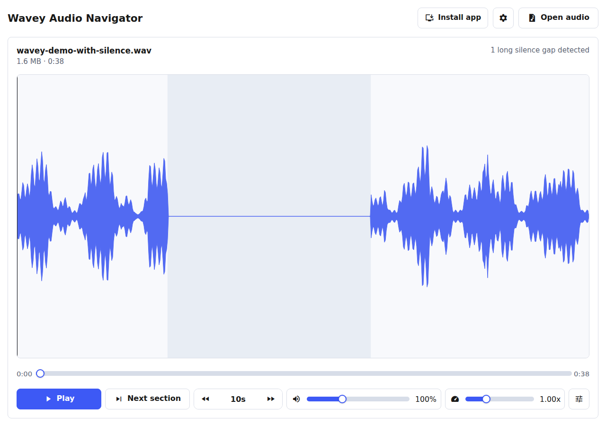

# Wavey Audio Navigator

A small local-first audio player for reviewing recordings with an interactive waveform, quick navigation controls, and silence-aware section jumps.

## Features

- Open common audio and video files locally; files are not uploaded.
- Seek through an interactive waveform and jump by fixed time intervals.
- Move between audible sections and inspect detected silence gaps.
- Adjust speed, pitch, volume, theme, language, and silence detection settings.
- Run as a static web app, install as a PWA, or load as a Chrome extension.

## Run

Open `index.html` in a browser, or serve the folder with any static file server.

## Chrome extension

Load the project folder in Chrome from `chrome://extensions` with Developer Mode enabled. To use the packaged source, unzip `dist/wavey-audio-navigator-1.1.0-chrome.zip` first, then load the extracted folder with Chrome's "Load unpacked" flow.
